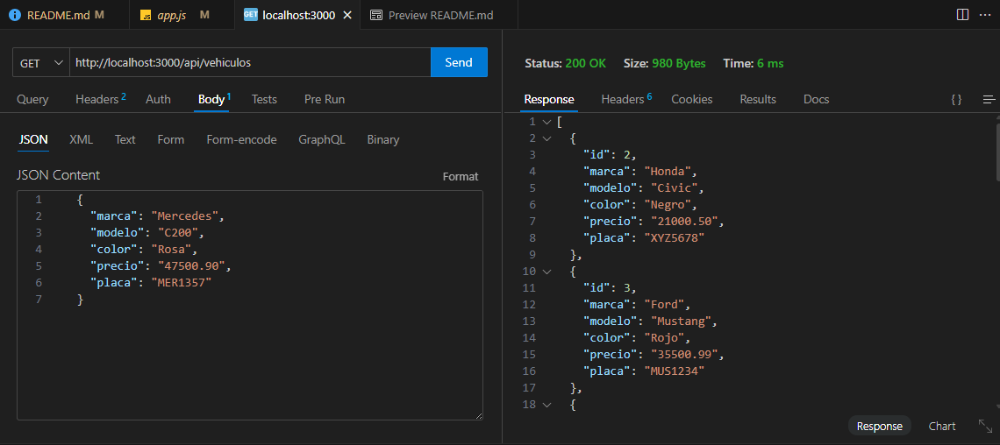
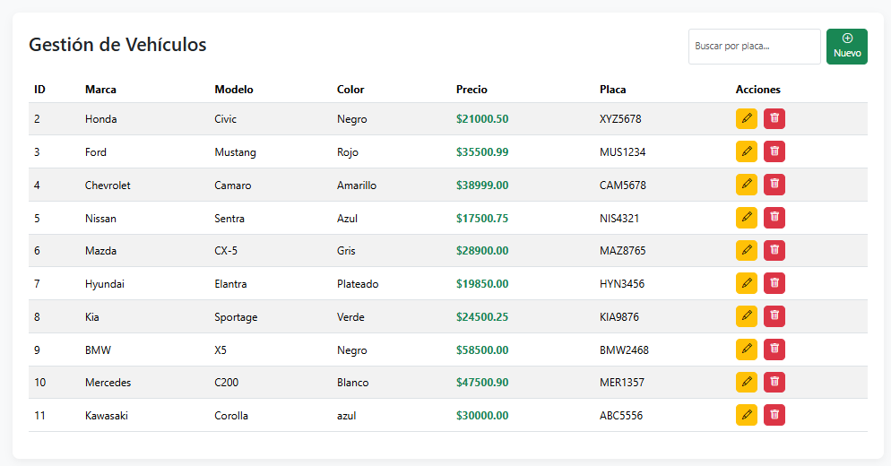

## APIRest utilizando Express + MySQL
No olvide construir la tabla:

```sql
CREATE DATABASE tiendaveh;
USE tiendaveh;

CREATE TABLE vehiculos
(
	id 		INT AUTO_INCREMENT PRIMARY KEY,
    marca 	VARCHAR(30) NOT NULL,
    modelo 	VARCHAR(30) NOT NULL,
    color 	VARCHAR(20) NOT NULL,
    precio	DECIMAL(9,2) NOT NULL,
    placa 	CHAR(7) NOT NULL,
    CONSTRAINT uk_placa_veh UNIQUE (placa)
)ENGINE = INNODB;
```
Módulos requeridos:
```
npm install express mysql2 dotenv nodemon
```

## Funcionalidades
- Listar todos los vehículos  
- Registrar un nuevo vehículo  
- Editar datos de un vehículo  
- Eliminar un vehículo  
- Buscar vehículo por placa  

## Rutas principales (Vistas Web)

| Método | Ruta                     | Descripción            |
|--------|---------------------------|-------------------------|
| GET    | /                         | Listar vehículos        |
| GET    | /vehiculos/crear           | Formulario creación     |
| POST   | /vehiculos/crear           | Crear vehículo          |
| GET    | /vehiculos/editar/:id      | Formulario edición      |
| POST   | /vehiculos/editar/:id      | Actualizar vehículo     |
| GET    | /vehiculos/eliminar/:id    | Confirmar eliminación   |
| POST   | /vehiculos/eliminar/:id    | Eliminar vehículo       |
| GET    | /vehiculos/buscar?placa=   | Buscar por placa        |

## Ejemplo JSON para POST / PUT:
```
{
  "marca": "Toyota",
  "modelo": "Corolla",
  "color": "Rojo",
  "precio": 15000.50,
  "placa": "ABC1234"
}

```
## Rutas API (Thunder Client / Postman)

| Método   | Endpoint                               | Descripción          |
|----------|----------------------------------------|----------------------|
| GET      | http://localhost:3000/api/vehiculos     | Listar vehículos      |
| POST     | http://localhost:3000/api/vehiculos     | Crear vehículo        |
| PUT      | http://localhost:3000/api/vehiculos/:id | Actualizar vehículo   |
| DELETE   | http://localhost:3000/api/vehiculos/:id | Eliminar vehículo     |
| GET      | http://localhost:3000/api/vehiculos/:placa | Buscar por placa    |

## Capturas sugeridas

- Thunder Client: mostrar cómo se ven las peticiones GET, POST, PUT, DELETE.

- Vistas Web: capturas de la lista de vehículos, formulario de creación y edición.

